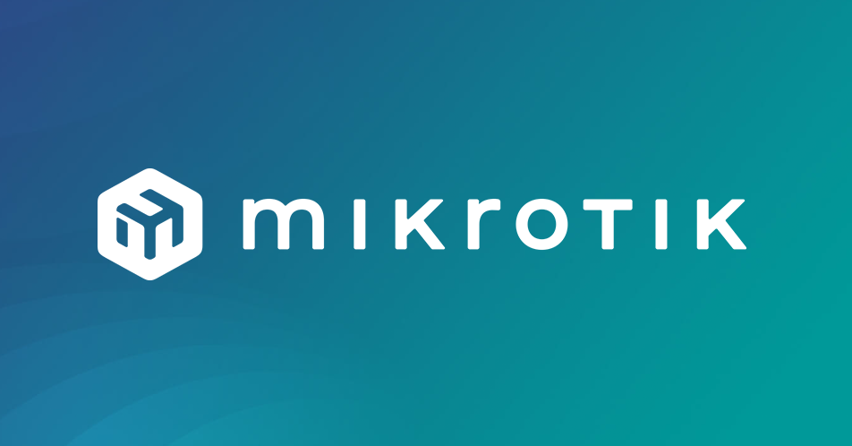

# Routeros Termux



Run MikroTik RouterOS CHR inside QEMU on Termux (Android). The installer pulls the
official RouterOS CHR image.

`No root required. Runs entirely in user space via QEMU's TCG emulation.`

## Requirements

- Android device running Termux
- ~2 GB free storage for the image and disk
- At least 1 GB of RAM available to the VM (the launcher requests 1024 MB)

Emulation uses `accel=tcg`, so performance depends on your CPU. This is intended for
learning, labs, and testing rather than production routing.

## Installation

```bash
curl -fsSL https://raw.githubusercontent.com/theshoqanebi/routeros_termux/main/install.sh | bash
```

## Usage

Start the RouterOS VM:

```bash
mikrotik
```

The VM boots in `-nographic` mode, so RouterOS output and the login prompt appear
directly in your terminal. Default RouterOS credentials are user `admin` with an empty
password (you will be asked to set one on first login).

To stop the VM, press `Ctrl-A` then `X`.

## Resource configuration

At startup the launcher applies its built-in defaults, then reads
`$PREFIX/etc/mikrotik/resource.cfg` if it exists. Only the keys present in the file
override the defaults; anything you leave out keeps its default value.

```ini
# Guest memory in MB (default: 1024)
RAM=2048

# Number of vCPUs (default: 2)
CPU_CORES=4

# QEMU CPU model (default: max)
#CPU_MODEL=max

# QEMU accelerator (default: tcg)
#ACCEL=tcg
```

| Key | Default | Description |
| --- | --- | --- |
| `RAM` | `1024` | Guest memory in MB (`-m`) |
| `CPU_CORES` | `2` | Number of vCPUs (`-smp`) |
| `CPU_MODEL` | `max` | QEMU CPU model (`-cpu`) |
| `ACCEL` | `tcg` | QEMU accelerator (`-machine accel=`) |

The config is sourced by the launcher, so treat it as a trusted file. Changes take
effect the next time you run `mikrotik`.

## Access

Services are forwarded from the guest to `localhost` on the host:

| Service | Address |
| --- | --- |
| SSH | `localhost:2222` |
| WinBox | `localhost:8291` |
| WebFig | `http://localhost:8080` |
| API | `localhost:8728` |
| API SSL | `localhost:8729` |

## Network layout

The launcher attaches four virtio network interfaces to the guest:

- **WAN** (`ether1`) — user-mode networking with the port forwards listed above.
- **LAN1 / LAN2 / LAN3** — QEMU socket interfaces listening on ports `10001`,
  `10002`, and `10003`. These let you connect other QEMU guests to the same
  virtual segments for multi-node topologies.

## VM specification

| Setting | Value |
| --- | --- |
| Accelerator | TCG (software emulation) |
| CPU | `max`, 2 cores |
| Memory | 1024 MB |
| Disk | 2 GB, raw, virtio |
| Image | `chr-7.23.1.img` |

## Notes

RouterOS and CHR are products of MikroTik. This project only automates downloading the
official image and running it under QEMU; it does not modify or redistribute RouterOS.
Refer to MikroTik's licensing terms for CHR usage.
